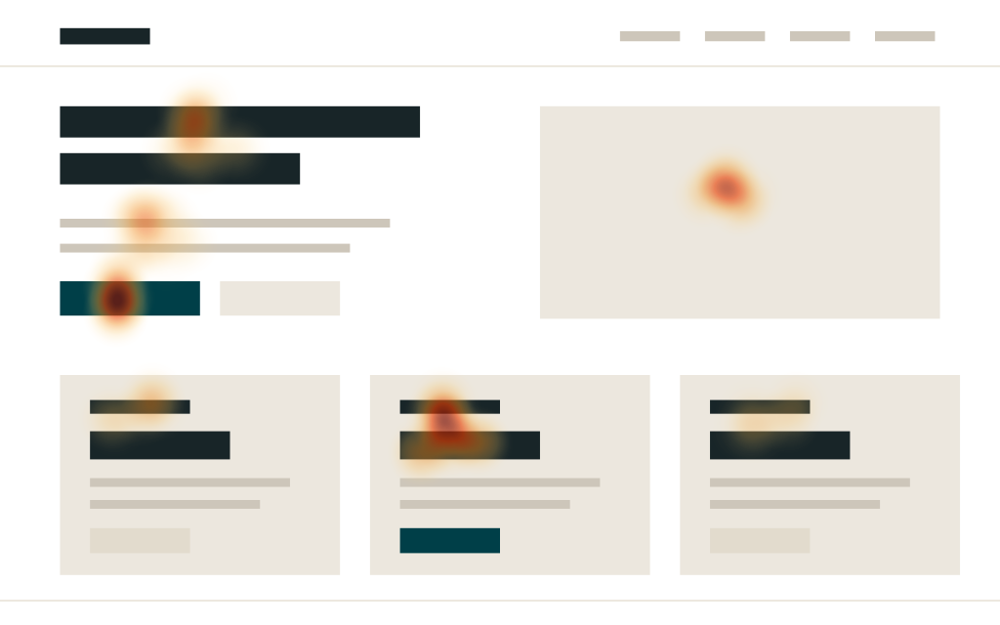
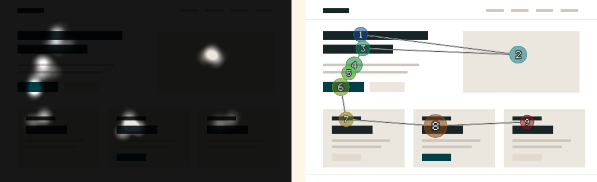

# Attention Lab

Webcam eye tracking for wireframes and web pages. Upload a screen, give a
participant a task, and get back a heatmap, a scanpath, and per-region
attention numbers. Everything runs in the browser — no video, gaze data, or
images ever leave the machine.

**Try it: [attention.ryankm.com](https://attention.ryankm.com/)** — a webcam, a
desktop browser, and about 90 seconds to calibrate. EXP-038 in
[the Lab](https://ryankm.com/lab).

Vanilla TypeScript and Vite, one runtime dependency (MediaPipe's face
landmarker), no framework, no server, no analytics.



Six recordings against one task, aggregated — then the same data as a
spotlight, which dims what nobody looked at, and as one participant's scanpath,
numbered in reading order and sized by dwell:



The session behind those figures is synthetic, and they are drawn by the app's
own renderers running headlessly — `npm run figures` regenerates them. So the
pictures cannot drift from what the app actually draws, and no participant data
comes anywhere near this repository.

## Quickstart

Node 20 or newer.

```
npm install
npm run dev      # http://localhost:5173
```

Optional, to avoid a CDN fetch on first run and work offline:

```
npm run fetch-model
```

## How it works

There is no eye-tracking hardware involved, so the gaze signal has to be
reconstructed from a normal webcam image:

1. **Face mesh** — MediaPipe's `FaceLandmarker` returns 478 points per frame.
   The last ten are the iris contours, which is what makes this possible at
   all; the standard 468-point mesh has no iris and therefore no gaze signal.
2. **Features** — iris centre offset from the eye corners, normalised by eye
   width, plus head yaw/pitch/roll, head position in frame, and apparent face
   size. Where you look is eyeball direction *plus* head pose, and the two
   interact multiplicatively, so the feature basis includes cross terms.
   (`src/tracker/features.ts`)
3. **Calibration** — the participant clicks 13 dots. Each click proves they are
   looking at a known screen coordinate, giving a supervised training set. A
   ridge regression maps features to screen pixels, with the regularisation
   strength picked by 5-fold cross-validation. (`src/tracker/regression.ts`)
4. **Validation** — five more dots, off the calibration grid, measure real error
   on points the model never saw. This is reported before recording, because a
   bad calibration produces a confident-looking heatmap that is simply wrong.
5. **Smoothing** — a One Euro filter, which smooths hard while the eye is still
   and gets out of the way during saccades. A fixed low-pass filter has to
   choose between jitter and lag; this one does not.
6. **Fixations** — I-DT dispersion clustering. Attention lives in fixations, not
   in the saccades between them, so heatmaps are built from fixation centroids
   weighted by dwell rather than from raw samples.

## Design decisions

[`docs/session-log.md`](docs/session-log.md) is the build log: MediaPipe over
WebGazer, ridge regression over a small neural net, One Euro over an
exponential moving average, I-DT fixations over raw-sample heatmaps — each with
the alternative that was rejected and the reason. It also carries the
off-by-one in the fixation window that the synthetic-eye suite caught, where
every recording would have produced zero fixations and every heatmap would have
rendered empty; what is verified and what is not; and what is still open.

## What you get

- **Heatmap** — dwell-weighted attention, scaled to a high percentile of the
  per-blob peaks rather than of the pixels, so one long stare saturates without
  flattening every other cluster into the clear end of the ramp. The ramp
  itself starts fully transparent: a region nobody fixated is left unpainted
  rather than tinted a cold colour that reads as attention it never got.
- **Spotlight** — the inverse: dims what was ignored. Usually the more
  persuasive version in a readout.
- **Contours** — banded isolines, easier to cite exact regions from.
- **Scanpath** — numbered fixations sized by dwell, in reading order. Per
  participant, since an averaged scanpath is meaningless.
- **Areas of interest** — draw boxes on the stimulus and get hit rate, dwell
  time, and time-to-first-fixation per region, aggregated across participants.
- **Exports** — PNG overlay at the stimulus's native resolution, plus raw gaze,
  fixation, and AOI CSVs and a session JSON.

## Accuracy, honestly

A webcam gives roughly **2-4° of visual angle** of error — about 50-120px at a
normal viewing distance. Dedicated hardware trackers claim 0.5°. In practice
that means:

- **Reliable**: which block, column, or card someone looked at; whether they
  ever found the CTA; broad scan order; comparing two layouts.
- **Not reliable**: which word someone read, which of two adjacent links they
  looked at, or anything requiring sub-heading precision.

Error rises when the participant moves their head after calibrating, when they
are lit from behind, when they wear strong glasses, or when they sit off-axis.
The app measures and reports this per session rather than hiding it — the
accuracy check after calibration is the number to trust, and it is stored with
every recording.

## Running a session

1. Create a study: drop in a wireframe or screenshot (or enter a URL), write a
   task prompt, set a duration.
2. Hit **Run session**, allow the camera, and calibrate.
3. Check the reported accuracy. If it says *Poor*, recalibrate — better light,
   sit square to the screen, stay still.
4. The task prompt appears; the participant presses space and the stimulus is
   shown full-bleed while gaze is recorded.
5. Repeat for each participant. Recordings against the same study aggregate
   into a single heatmap automatically.

Gaze is stored in normalised stimulus coordinates, so participants on different
screen sizes still aggregate correctly.

### URL stimuli

Entering a URL loads the page in an iframe. Many sites send
`X-Frame-Options: DENY` or a restrictive `frame-ancestors` and will refuse to
load — for those, take a screenshot and use it as an image stimulus. Static
images are also the more rigorous choice, since every participant then sees
byte-identical content.

## Practical notes

- **Lighting matters more than camera quality.** Face lit from the front, no
  bright window behind.
- **Calibrate every participant.** Calibration is per-person and per-seating
  position. It is cached in `sessionStorage` for a repeat run in the same
  sitting and deliberately not persisted longer, because a stale calibration
  fails silently.
- **Give a real task.** Free-viewing heatmaps mostly show you where the biggest
  image is. Task-driven ones show you whether your interface works.
- **Five to eight participants** is usually enough to see a pattern at this
  precision. Aggregate heatmaps get meaningfully more stable up to about eight
  and change little after.

## Layout

```
src/
  tracker/     camera, face mesh, feature extraction, regression, filtering
  analysis/    fixation detection, heatmap, scanpath, AOI statistics
  data/        IndexedDB persistence, CSV/JSON/PNG export
  ui/          study setup, calibration, recording, results
  tests/       headless checks for the maths
scripts/       model vendoring, README figure generation
docs/          engineering log, README figures, design sources
```

## Tests

```
npm test
npm run typecheck
```

The suite runs the gaze model against a simulated eye — a forward model that
turns a screen target plus head pose into iris offsets — and asserts the
pipeline recovers screen positions it was never trained on, including under
head drift. Also covers fixation detection, the smoothing filter, overlay
painting, and AOI statistics. `npm run build` runs `tsc` first and refuses to
emit on a type error.

## Privacy

The camera feed is processed frame by frame in the page and never recorded or
transmitted. Studies and recordings live in IndexedDB in the browser profile.
There is no server. If you deploy this for remote participants, note that
recording someone's gaze is personal data in most jurisdictions — get informed
consent, and remember the webcam permission prompt is not consent to
participate in research.

## Requirements

A Chromium-based browser or Safari 16.4+, a webcam, and a secure context
(`localhost` or HTTPS — `getUserMedia` will not run over plain HTTP on a LAN
address). A phone can read a study and open results recorded elsewhere, but
cannot run a session: the camera is too close and too far off-axis, and
calibration would ask you to cover the target with your thumb.

## License

MIT — see [LICENSE](LICENSE). Built by [Ryan McCarty](https://ryankm.com).
